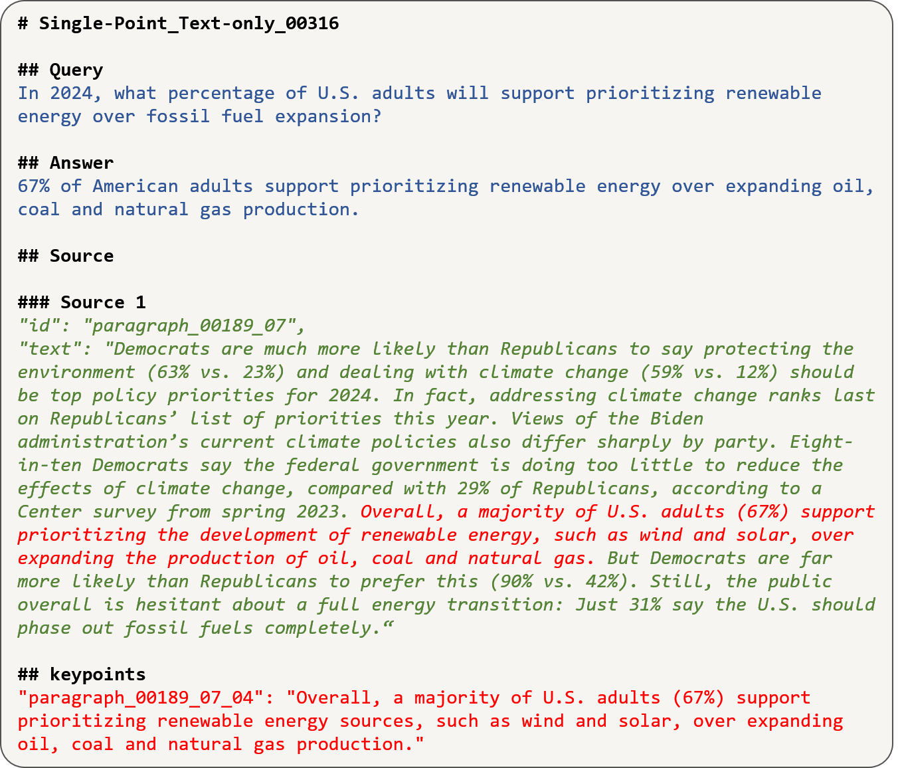

# Benchmarking Multimodal RAG through a Chart-based Document Question-Answering Generation Framework

## Overview

Multimodal Retrieval-Augmented Generation (MRAG) enhances reasoning capabilities by integrating external knowledge. However, existing benchmarks primarily focus on simple image-text interactions, overlooking complex visual formats like charts that are prevalent in real-world applications. In this work, we introduce a novel task, **Chart-based MRAG**, to address this limitation.

To semi-automatically generate high-quality evaluation samples, we propose **CHAR**t-based document question-answering **GE**neration (CHARGE), a framework that produces evaluation data through structured keypoint extraction, crossmodal verification, and keypoint-based generation.

By combining CHARGE with expert validation, we construct **Chart-MRAG Bench**, a comprehensive benchmark for chart-based MRAG evaluation, featuring 4,738 question-answering pairs across 8 domains from real-world documents.

Our evaluation reveals three critical limitations in current approaches:
1. Unified multimodal embedding retrieval methods struggle in chart-based scenarios.
2. Even with ground-truth retrieval, state-of-the-art MLLMs achieve only 58.19% Correctness and 73.87% Coverage scores.
3. MLLMs demonstrate consistent text-over-visual modality bias during Chart-based MRAG reasoning.

**The CHARGE and Chart-MRAG Bench are released at [GitHub](https://github.com/Nomothings/CHARGE.git).**

**The paper can be found at [arXiv](https://arxiv.org/abs/2502.14864).**


## Dataset Statistics

- Total samples: 4,738
- Samples with charts: 3,026
- Samples without charts: 1,712

## Data Format

Each sample in the dataset contains the following fields:

- `id`: Unique identifier for each sample
- `query`: Question about the chart content
- `gt_answer`: Ground truth answer to the query
- `gt_chart`: Chart image data (when available)
- `gt_text`: Relevant textual context
- `gt_keypoints`: Key information points extracted from the chart

## Data Structure

The dataset is provided in the HuggingFace datasets format, with the following structure:
```
data/
└── data-00000-of-00001.arrow  # Main data file containing all samples
```

## Usage

To use this dataset in your research:

```python
from datasets import load_dataset

# Load the dataset
dataset = load_dataset("ymyang/chart-mrag")

# Access a sample
sample = dataset[0]

# Access different fields
question = sample['query']
answer = sample['gt_answer']
chart = sample['gt_chart']  # Image data
```

## Dataset Features

1. **Multimodal Content**: Integrates both visual (charts) and textual information
2. **Diverse Question Types**: Covers various aspects of chart understanding and interpretation
3. **Ground Truth Annotations**: Includes carefully curated answers and key points
4. **Standardized Format**: Follows HuggingFace datasets convention for easy integration

## Dataset Samples



## Citation

If you use this dataset in your research, please cite:

```bibtex
@article{yang2025benchmarking,
  title={Benchmarking Multimodal RAG through a Chart-based Document Question-Answering Generation Framework},
  author={Yang, Yuming and Zhong, Jiang and Jin, Li and Huang, Jingwang and Gao, Jingpeng and Liu, Qing and Bai, Yang and Zhang, Jingyuan and Jiang, Rui and Wei, Kaiwen},
  journal={arXiv preprint arXiv:2502.14864},
  year={2025}
}
```

## License

[License information to be added]

## Contact

For questions and feedback about the dataset, please open an issue in the repository. 
